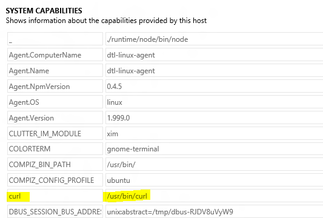
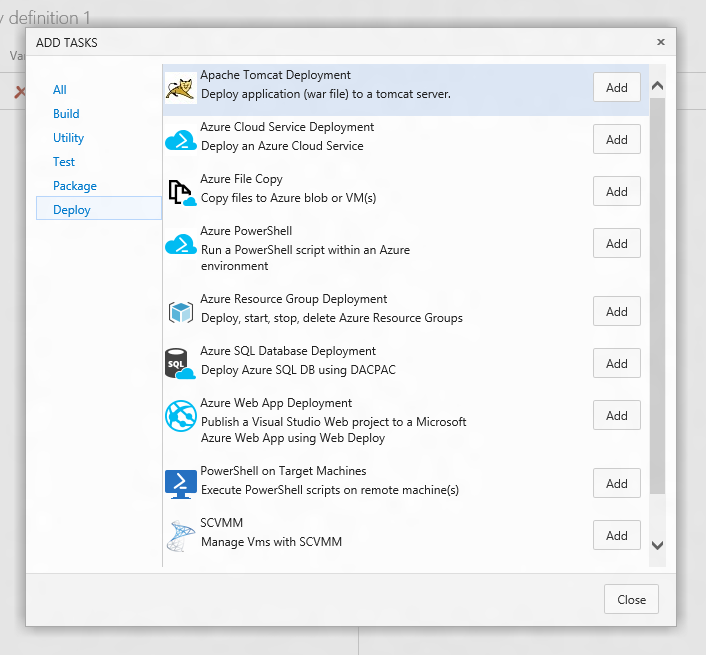
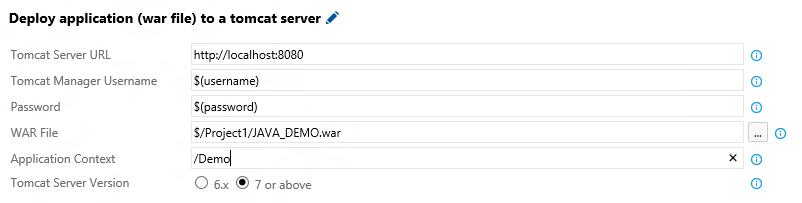
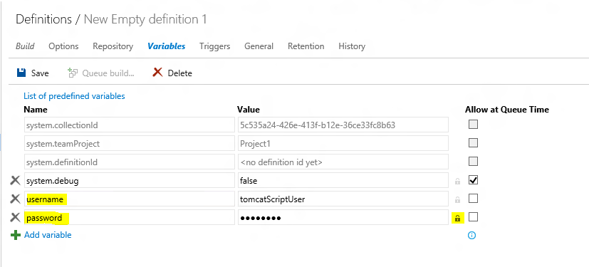

#Deploy web applications to Apache Tomcat server
Deploy your Java web applications to a tomcat server from Visual Studio Team Services or Team Foundation Server.
Currently the following features are available:
* Deploy/Re-deploy to Tomcat manager. Copies the war file to the target automatically.

This extension installs the following components
* Apache Tomcat Deployment task - A Build/Release task to deploy WAR files. [Learn more](http://aka.ms/tomcatdeploymenttask)

##Usage
The deployment tasks use cURL.
1. Install cURL on Build/Release agent

2. Make sure cURL is reported as an agent capability

3. If not detected automatically, add manually

 
 

###Using Apache Tomcat Deployment task to deploy WAR files
1. Open your build or release definition and add the Apache Tomcat Deployment task. The task can be found in the **Deploy** section of the **Add Tasks** dialog.

 
2. Fill-in the task parameters as described below:

[Learn More](http://aka.ms/tomcatdeploymenttask)

##Compatibility
Supports Tomcat 6.x, 7.x and 8.x

##Contact Information
For further information, resolving issues or giving feedback [send mail](mailto:RM_Customer_Queries@microsoft.com?Subject=[Feedback]Apache Tomcat Extension).

##Trademarks
"Apache Tomcat" and "Tomcat" are trademarks of the Apache Software Foundation.
